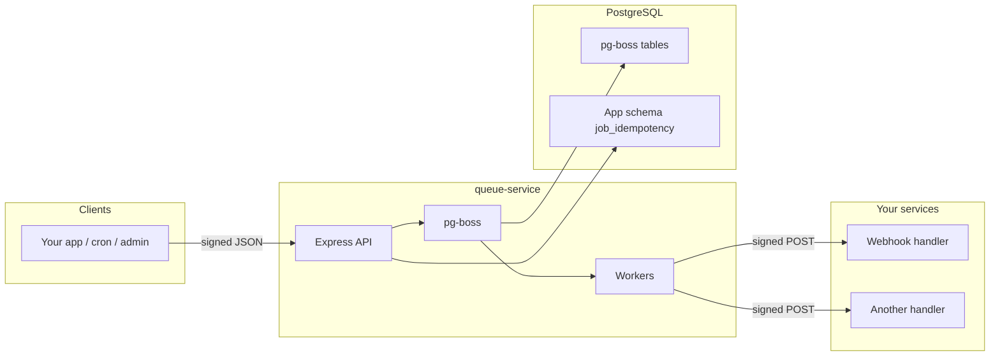

# bq-queue

**bq-queue** is a monorepo for **Blockqueue** queue scheduling. The main deliverable is **queue-service**: an [Express](https://expressjs.com/) HTTP API that enqueues work in [pg-boss](https://timgit.github.io/pg-boss/) (PostgreSQL-backed job queues) and runs **workers** that deliver signed HTTP requests to URLs you configure per queue.

Use it when you want a single place to schedule jobs, retry failures, and fan out work to internal HTTP services—without each service implementing its own queue.

---

## Table of contents

1. [Architecture](#architecture)
2. [Repository layout](#repository-layout)
3. [Prerequisites](#prerequisites)
4. [Quick start](#quick-start)
5. [Environment variables](#environment-variables)
6. [Scheduler configuration (YAML)](#scheduler-configuration-yaml) — [Cleanup](#cleanup-global-vs-per-project)
7. [HTTP API](#http-api)
8. [Authenticating requests to the queue service](#authenticating-requests-to-the-queue-service)
9. [What your downstream endpoint receives](#what-your-downstream-endpoint-receives)
10. [Idempotency](#idempotency)
11. [Static cron jobs (config)](#static-cron-jobs-config)
12. [Database and migrations](#database-and-migrations)
13. [Docker](#docker)
14. [Development](#development)
15. [Testing](#testing)

---

## Architecture



1. **Clients** call the queue service over HTTPS (or HTTP in dev) with a **signed** JSON body.
2. **pg-boss** stores jobs and drives retries, concurrency, and retention according to config.
3. **Workers** (registered per queue) `fetch` the queue’s `endpoint`, sending a **different** signature (per-queue `signature_secret`) so your service can verify the caller.

---

## Repository layout

| Path                          | Purpose                                                   |
| ----------------------------- | --------------------------------------------------------- |
| `apps/queue-service/`         | Queue service source, `config/`, tests under `tests/`     |
| `packages/eslint-config/`     | Shared ESLint config                                      |
| `packages/typescript-config/` | Shared TypeScript config                                  |
| `docker/`                     | Dockerfiles, compose fragments, DB/dashboard env examples |

---

## Prerequisites

- **Node.js** ≥ 18
- **npm** (workspaces)
- **PostgreSQL** reachable by the service (same DB used by pg-boss and Drizzle migrations)

---

## Quick start

```bash
git clone <your-repo-url> bq-queue
cd bq-queue
npm install
```

### 1. Database

Create a database and user, or use Docker (see [Docker](#docker)). You need a connection string for `POSTGRES_DATABASE_URL`.

### 2. Queue service environment

From `apps/queue-service/`, copy env and add one or more scheduler YAML files under your config directory:

```bash
cd apps/queue-service
# Create .env with at least POSTGRES_DATABASE_URL, REQUEST_SIGNING_SECRET, PORT (3000–10000),
# and SCHEDULER_CONFIG_DIR (path to the directory that holds your *.yml / *.yaml files)
cp .env.example .env
# Example: copy project samples into config/ and rename/edit (see Scheduler configuration below)
cp config/prj-a-config.sample.yml config/prj-a.yml
cp config/prj-b-config.sample.yml config/prj-b.yml
```

Apply migrations (after setting `POSTGRES_DATABASE_URL`):

```bash
npm run db:apply:migration
```

### 3. Build and run

```bash
# From apps/queue-service
npm run build
npm run start
# Or from repo root after build
npx turbo run start --filter=queue-service
```

The service listens on `PORT` (default must be in the 3000–10000 range per validation).

### 4. Call the API

Use the signing flow in [Authenticating requests to the queue service](#authenticating-requests-to-the-queue-service). Example: enqueue a one-off job with `POST /api/jobs/one-off`.

---

## Environment variables

Loaded via `dotenv` from `.env` when present. All are validated at startup (`src/env.ts`).

| Variable                 | Required  | Description                                                                                                                                          |
| ------------------------ | --------- | ---------------------------------------------------------------------------------------------------------------------------------------------------- |
| `POSTGRES_DATABASE_URL`  | **Yes**   | PostgreSQL connection URL for pg-boss and app tables                                                                                                 |
| `REQUEST_SIGNING_SECRET` | **Yes**   | Shared secret for **incoming** requests to `/api/jobs/*` (HMAC signature)                                                                            |
| `PORT`                   | **Yes\*** | HTTP port; must be between **3000 and 10000** (inclusive). Set explicitly if unset defaults break validation                                         |
| `NODE_ENV`               | No        | `development` \| `production` \| `test` (default `development`)                                                                                      |
| `POSTGRES_SSL`           | No        | If `true`, connects with TLS (`rejectUnauthorized: false` for dev-style setups)                                                                      |
| `SCHEDULER_CONFIG_DIR`   | **Yes**   | Path to a **directory** whose `*.yml` / `*.yaml` files are loaded as scheduler config (see [Scheduler configuration](#scheduler-configuration-yaml)) |

\*If `PORT` is missing, ensure your environment sets a valid port in range.

---

## Scheduler configuration (YAML)

**Location:** `SCHEDULER_CONFIG_DIR` must point to an **existing directory** (resolved to an absolute path). There is no default single-file path.

**Multiple files:** Every `*.yml` and `*.yaml` file in that directory is loaded in **sorted filename order**. Each file is a full scheduler document (one logical “project” per file): `queues`, optional `global`, optional `cron_jobs`, optional `cleanup`.

- **Per-file errors** (invalid YAML, schema failure, cron referencing an undefined queue in that file): the service **logs the error and skips that file**; startup continues.
- **Across files:** **Queue names** and static cron **`name`** values must be unique among successfully loaded files. If a later file would repeat a queue name or cron name already taken by an earlier file, that **whole later file is skipped** and an error is logged.
- **No valid files:** the service still starts; you get a warning and **no queues** until configs are fixed.

Values support **`${ENV_VAR}`** substitution (see `src/config/substituteEnv.ts`).

### Top-level keys (each file)

| Key         | Required | Description                                                                                                                                                                           |
| ----------- | -------- | ------------------------------------------------------------------------------------------------------------------------------------------------------------------------------------- |
| `queues`    | **Yes**  | Map of queue name → queue definition. **Only these names** are accepted by the one-off and schedule APIs                                                                              |
| `global`    | No       | Defaults applied to queues: `default_queue_concurrency`, `max_concurrent_jobs`, `retryLimit`, `retryDelay`, `retryBackoff`, `expireInSeconds` (used when a queue omits its own), etc. |
| `cron_jobs` | No       | Static schedules; each entry must reference a `queue` defined in `queues`                                                                                                             |
| `cleanup`   | No       | See [Cleanup: global vs per project](#cleanup-global-vs-per-project) below; sample files and `src/config/schema.ts`                                                                   |

### Cleanup: global vs per project

The service runs **one** [pg-boss](https://timgit.github.io/pg-boss/) instance for all loaded YAML files. The optional `cleanup` block is therefore used in **two different scopes**:

| Scope                            | Which `cleanup` fields                                                                        | How it is chosen                                                                                                                                                                   |
| -------------------------------- | --------------------------------------------------------------------------------------------- | ---------------------------------------------------------------------------------------------------------------------------------------------------------------------------------- |
| **Boss-wide** (single instance)  | `maintenance_interval_seconds`, `warning_retention_days` — passed to the `PgBoss` constructor | Taken from the **first** loaded file (sorted filename order among successfully accepted segments) **that includes a `cleanup` key**. If no file defines `cleanup`, defaults apply. |
| **Per queue** (per project file) | `retention_days`, `delete_after_days` — applied when each queue is created (`createQueue`)    | Each file’s own `cleanup` is used for **that file’s queues** only. Different projects can set different retention.                                                                 |

**Practical notes**

- If every project file repeats the same `maintenance_interval_seconds` / `warning_retention_days`, behavior matches a single global setting; only one source is actually passed to the constructor (the first file that has `cleanup`).
- If only one file should control boss-wide options, put a `cleanup` section with those two fields in the file that sorts **first** alphabetically among your YAML names, or keep identical values in every file’s `cleanup` so any choice is equivalent.
- Per-queue retention is independent: project B’s `retention_days` / `delete_after_days` affect only queues declared in project B’s file.

### `queues.<name>` (each queue)

| Field                                      | Required | Description                                                                                       |
| ------------------------------------------ | -------- | ------------------------------------------------------------------------------------------------- |
| `endpoint`                                 | Yes      | URL the worker calls when a job runs                                                              |
| `signature_secret`                         | Yes      | Secret used to sign **outbound** requests to `endpoint` (header `[env.SIGNATURE_HEADER]`)         |
| `method`                                   | No       | HTTP method (default `POST`)                                                                      |
| `max_concurrent_jobs`                      | No       | Concurrency for this queue (overrides `global.default_queue_concurrency` / `max_concurrent_jobs`) |
| `retryLimit`, `retryDelay`, `retryBackoff` | No       | Retry behaviour for failed deliveries                                                             |
| `expireInSeconds`                          | No       | Job expiry (≥ 1 if set)                                                                           |
| `wait_interval_after_success_seconds`      | No       | Optional delay after a successful HTTP response before completing the job                         |
| `description`                              | No       | Documentation only                                                                                |

See [`apps/queue-service/config/prj-a-config.sample.yml`](apps/queue-service/config/prj-a-config.sample.yml) and [`apps/queue-service/config/prj-b-config.sample.yml`](apps/queue-service/config/prj-b-config.sample.yml) for commented examples you can copy into your config directory.

---

## HTTP API

Base URL: `http://localhost:<PORT>` (or your deployment URL).
All job endpoints expect **`Content-Type: application/json`** and a **raw JSON body** (the server uses `express.raw` so the body bytes match the signature—do not send pretty-printed JSON unless that exact string was signed).

### `GET /api/health`

|             |                                                 |
| ----------- | ----------------------------------------------- |
| **Purpose** | Liveness: pg-boss instance is ready             |
| **200**     | `{ "ok": true }`                                |
| **503**     | `{ "ok": false }` if pg-boss is not initialized |

No signature required.

---

### `POST /api/jobs/one-off`

Enqueue one or more jobs immediately. The body **must be a JSON array** (use a one-element array for a single job).

**Headers:** `x-bq-queue-request-signature` (required), `Content-Type: application/json`

**Body (JSON):** a non-empty array of objects:

| Field            | Type   | Required | Description                                                        |
| ---------------- | ------ | -------- | ------------------------------------------------------------------ |
| `idempotencyKey` | string | Yes      | Non-empty; used to dedupe and replace prior jobs with the same key |
| `queue`          | string | Yes      | Must exist in `config.queues`                                      |
| `payload`        | object | No       | Arbitrary JSON object; forwarded inside the job (default `{}`)     |

**Responses:**

| Status | Meaning                                                                               |
| ------ | ------------------------------------------------------------------------------------- |
| `202`  | `{ "jobs": [ { "jobId": "<pg-boss job id>" }, ... ] }` (same order as body)           |
| `400`  | Validation, empty array, or unknown `queue` (may include `index` of the failing item) |
| `401`  | Invalid or missing signature                                                          |
| `503`  | pg-boss unavailable                                                                   |
| `500`  | Failed to enqueue (may include `index` of the failing item)                           |

---

### `POST /api/jobs/schedule`

Schedule the next run from a cron expression for one or more jobs (each stored as a delayed job). The body **must be a JSON array** (use a one-element array for a single job).

**Headers:** same as one-off.

**Body (JSON):** a non-empty array of objects:

| Field            | Type   | Required | Description                                                                          |
| ---------------- | ------ | -------- | ------------------------------------------------------------------------------------ |
| `idempotencyKey` | string | Yes      | Non-empty                                                                            |
| `queue`          | string | Yes      | Must exist in `config.queues`                                                        |
| `schedule`       | string | Yes      | Cron expression (parsed with timezone)                                               |
| `timezone`       | string | No       | IANA timezone (default `UTC`)                                                        |
| `payload`        | object | No       | Merged into job data; `idempotencyKey` is always included in the payload for workers |

**Responses:**

| Status | Meaning                                                                         |
| ------ | ------------------------------------------------------------------------------- |
| `201`  | `{ "jobs": [ { "id": "<idempotencyKey>" }, ... ] }` (same order as body)        |
| `400`  | Invalid body, empty array, unknown queue, or invalid cron (may include `index`) |
| `401`  | Signature                                                                       |
| `503`  | pg-boss unavailable                                                             |
| `500`  | Failed to schedule (may include `index`)                                        |

---

### `POST /api/jobs/delete`

Cancel the pg-boss job and remove the idempotency row for a key.

**Headers:** same as one-off.

**Body (JSON):**

| Field            | Type   | Required           |
| ---------------- | ------ | ------------------ |
| `idempotencyKey` | string | Yes (min length 1) |

**Responses:**

| Status | Meaning                            |
| ------ | ---------------------------------- |
| `200`  | `{ "deleted": true }`              |
| `400`  | Invalid body                       |
| `404`  | No idempotency record for that key |
| `401`  | Signature                          |

---

## Authenticating requests to the queue service

Incoming job requests must include header:

```http
x-bq-queue-request-signature: t=<unix_seconds>,v1=<hmac>
```

- **Algorithm:** HMAC-SHA512 by default (see `src/utils/verifySignature.ts` for optional `sha256` / encodings).
- **Message:** `<timestamp>.` + **exact** raw body string (UTF-8).
- **Timestamp:** Unix **seconds** (not milliseconds). Default tolerance: **±300 seconds** from server time.

To build the header in Node (same helpers as tests):

```ts
import { createSignature } from './path/to/createSignature'; // or reimplement

const body = JSON.stringify([
  {
    idempotencyKey: 'my-key',
    queue: 'MY_QUEUE',
    payload: {},
  },
]);
const header = createSignature({
  payload: body,
  secret: process.env.REQUEST_SIGNING_SECRET!,
});
// fetch(url, { method: 'POST', headers: { 'Content-Type': 'application/json', 'x-bq-queue-request-signature': header }, body })
```

---

## What your downstream endpoint receives

When a job runs, the worker POSTs (by default) to `queues.<name>.endpoint` with:

| Header                   | Value                                                                                     |
| ------------------------ | ----------------------------------------------------------------------------------------- |
| `Content-Type`           | `application/json`                                                                        |
| `[env.SIGNATURE_HEADER]` | `t=...,v1=...` using **`signature_secret`** for that queue (not `REQUEST_SIGNING_SECRET`) |

**Body:** JSON string of either:

- `{ "timestamp": <unix>, "data": <payload> }` for object payloads, or
- the raw payload encoding for non-object data

Verify `[env.SIGNATURE_HEADER]` the same way (HMAC over `timestamp + "." + body` with the queue’s `signature_secret`). Request timeout is **2 minutes**.

SIGNATURE_HEADER is the string you set in your env file.

---

## Idempotency

- Rows are stored in PostgreSQL (`job_idempotency` in schema `bq_queue`).
- **One-off:** `idempotencyKey` maps to the pg-boss job id; resubmitting replaces the previous job after cancel/delete of the old record.
- **Schedule:** same key; dynamic schedules include `idempotencyKey` in the job payload; after success, dynamic cleanup can remove the row (see worker + boss integration).
- **Delete:** removes the row and cancels the boss job when possible.

---

## Static cron jobs (config)

Under `cron_jobs`, each item needs:

- `name` – unique key for pg-boss scheduling
- `queue` – must match a key in `queues`
- `schedule` – cron string
- `timezone` – optional, default `UTC`
- `payload` – optional object passed into the scheduled job

On startup, the service calls pg-boss `schedule()` for each entry in each **accepted** file. Cron `name` values must be unique across all files (see [Scheduler configuration](#scheduler-configuration-yaml)). If one file is invalid, only that file is skipped; static crons in other files still apply.

---

## Database and migrations

- **App tables:** Drizzle schema in `apps/queue-service/src/db/schema/`.
- **Migrations:** `apps/queue-service/src/db/migrations/`.

Commands (from `apps/queue-service`):

```bash
npm run db:generate:migration   # after editing schema
npm run db:apply:migration    # apply migrations
```

Set `POSTGRES_DATABASE_URL`. pg-boss creates its own schema/tables on first use.

---

## Docker

[`docker-compose.yml`](docker-compose.yml) includes:

- **database** – PostgreSQL (see `docker/database/.env` — set `POSTGRES_USER`, `POSTGRES_DB`, and `POSTGRES_PASSWORD` so the healthcheck and volume init work)
- **pg-boss-dashboard** – monitoring UI (port **3000**)
- **queue-service-dev** – dev image mounting `apps/queue-service` (port **9000** in compose); requires `apps/queue-service/.env` with `SCHEDULER_CONFIG_DIR` pointing at your YAML directory (e.g. `./config`)

The repo [`.dockerignore`](.dockerignore) excludes `**/database/data` so local Postgres volume directories (often root-owned) are not sent as build context and do not break `docker compose build`.

Adjust ports and env files to match your setup. Start order: database healthy → other services.

---

## Development

| Command                   | Where                | Description                               |
| ------------------------- | -------------------- | ----------------------------------------- |
| `npm install`             | repo root            | Install all workspaces                    |
| `npm run build`           | root                 | `turbo run build`                         |
| `npm run dev`             | root                 | `turbo run dev`                           |
| `npm run lint`            | root                 | `turbo run lint`                          |
| `npm run test`            | root                 | `turbo run test`                          |
| `npm run dev`             | `apps/queue-service` | nodemon (see app `package.json`)          |
| `npm run build` / `start` | `apps/queue-service` | TypeScript compile / `node dist/index.js` |

Use a `.env` in `apps/queue-service` for local runs.

---

## Testing

Tests live under **`apps/queue-service/tests/`**:

- `tests/unit/` – unit tests
- `tests/integration/` – HTTP integration tests with `createApp`

```bash
cd apps/queue-service
npm run test
```

Optional `apps/queue-service/.env.test` is loaded by `tests/setup.ts` for CI/local parity.

---

## Useful links

- [pg-boss documentation](https://timgit.github.io/pg-boss/)
- [Turborepo](https://turborepo.com/docs)

---

## App-specific quick reference

See **[apps/queue-service/README.md](apps/queue-service/README.md)** for paths and scripts in one place.
